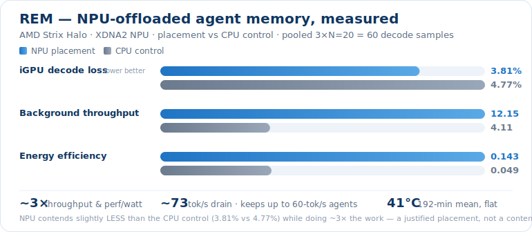

# REM — agent memory on a background co-processor

<p align="center">
  
</p>

<p align="center">
  <a href="index.html"></a>
</p>

<p align="center">
  <sub>Self-contained <code>index.html</code> — open it locally, or view it on GitHub Pages once the repo is published.</sub>
</p>


-1f74c4)


**Status:** research, pre-1.0 · Strix Halo (AMD Ryzen AI)

**One line:** While the big model is *awake* on the iGPU, the NPU *sleeps on it* —
consolidating the agent's working memory on separate compute silicon, off the GPU's
critical path and inside a measured contention budget.

**REM = Resident Externalized Memory** — the agent-memory layer *externalized* off
the model's context window and made *resident* on a dedicated co-processor (the NPU).
(The name also nods to REM sleep, the phase where brains consolidate memory.)

REM explores whether the AMD XDNA2 NPU on Strix Halo can own the **memory-maintenance**
work for a local agent — compacting a growing conversation into a compact, fact-
preserving context — so the iGPU stays free for the foreground model. This repo is a
**feasibility study**: it shows the placement works and runs cheaply, and names the
problems still worth solving.

## What's demonstrated vs. what's open

This is the honest shape of the project. The feasibility pillars hold on real
hardware; the quality work is a clear development path, not a finished result.

**Demonstrated (measured on a Strix Halo box):**
- **Off the critical path.** Compaction runs in a background thread; the foreground
  turn returns without waiting on it. The per-compaction latency (~18–24 s) is not a
  per-turn stall.
- **It keeps up.** The NPU compactor drains context at **~73 tok/s** — comfortably
  above a realistic local-agent context-growth rate, so the backlog stays bounded.
- **It runs cool.** A **192-minute** sustained compaction run held the SoC die at
  **mean 41 °C / max 61 °C, no upward drift** (a separate 116-minute run peaked at
  62 °C) — tens of degrees below thermal throttle.
- **The placement is justified.** A concurrent NPU job costs **~3.8 %** iGPU decode
  loss vs **~4.8 %** for the same job on spare CPU cores (the NPU contends *slightly
  less*), at **~3× throughput** and **~3× perf/watt** — raw artifacts in
  [`bench/contention/`](bench/contention/), auditable with `verify_contention.py`.
- **The compaction mechanism runs.** It extracts facts and rewrites the oldest span
  at **~10× compression** (9.9× measured by the throughput probe). Whether buried
  facts *reliably survive* that compression — evidence retention — is an open quality
  question (below), **not** a settled result.

**To be developed (where we'd welcome help):**
- **Small-model JSON robustness.** The on-NPU model sometimes emits malformed JSON
  during fact extraction, and those facts get dropped. A repair/retry pipeline exists
  but isn't bulletproof.
- **Fact identity / supersession.** When a value is updated ("I moved to Denver"),
  REM can still surface the stale one. The path forward is embedding-based identity
  (matching facts by meaning, not string labels) as a second layer.
- **Quality vs. a naive baseline is unproven and budget-conditional.** At a generous
  context budget, simple truncation keeps the recent answer and can match or beat REM;
  REM's advantage should show up only when the budget is tight enough that truncation
  drops the fact. The one judged battery run so far was **invalidated** (its budget was
  too generous to test the hypothesis), and on that subset REM's answer accuracy was
  *lower* than truncation's (0.4 vs 0.6). A valid tight-budget win — plus the
  JSON-robustness fix above — is the open path to a defensible quality number.

**Honest framing:** this is *not* "contention-free" and *not* a latency-reduction
trick. The NPU shares the unified memory bus; it is a *placement* win (throughput +
perf/watt + keeping the foreground free), and async only helps while the drain rate
keeps up — if it falls behind, the context backlog can overflow a hard cap and fail
the turn.

## The metaphor (it maps)

| Brain | REM |
|---|---|
| Awake, doing tasks | iGPU running the big foreground model |
| Hippocampus consolidating during sleep | NPU compacting + filing memory in the background |
| Working memory (volatile, recent) | the compaction channel (verbatim → summaries → facts) |
| Long-term semantic memory (durable) | a markdown/wiki memory store |
| The body scheduling sleep vs. wake | a contention-aware scheduler |

## Results

**Placement & contention** (pooled over 3 runs × N=20 = 60 decode samples; measured
with the [xdna-top](https://github.com/boxwrench/xdna-top) monitor):

| Condition | iGPU decode loss | bg throughput (tok/s) | gen-tok/s per board W |
|---|---:|---:|---:|
| Baseline (iGPU only) | 0.00 % | — | — |
| NPU concurrent | **3.81 %** (3.4–4.2) | 12.15 ± 1.20 | 0.143 |
| CPU concurrent | 4.77 % (4.2–5.1) | 4.11 ± 0.80 | 0.049 |

**Compaction throughput** (the keep-up axis): drain **~73 tok/s**, per-call median
~19 s (decode-bound — the lever is the compactor model / output cap, not the span
size). See `bench/battery/throughput_probe.json` and `bench/battery/sweep/`.

**Thermal** (sustained load): `bench/battery/thermal_trace*.csv` — a 192-min run held
SoC Tctl at mean 41 °C / max 61 °C, flat (a separate 116-min run peaked at 62 °C).

Full methodology and caveats: `docs/npu-placement-benchmark.md`.

## How it works

A sidecar sits in front of the foreground model's chat endpoint. It keeps a tiered
memory state — recent turns **verbatim**, older spans compacted into **summaries**
plus a **facts ledger** — and assembles a budget-bounded context for each request.
When the verbatim tier crosses a threshold, compaction fires **in a background thread
on the NPU**: it extracts load-bearing facts from the oldest span and replaces it
with a summary, never blocking the foreground turn.

## Run it

```bash
pip install -e ".[dev]"          # core + test deps
pip install -e ".[dev,eval]"     # add the battery's Claude judge (anthropic)

# Audit the canonical contention numbers from committed raw artifacts (no hardware)
python bench/contention/verify_contention.py

# Re-measure contention on a Strix Halo box (canonical = --trials 20, repeated 3x;
# requires the iGPU/NPU/CPU engines serving — see docs/npu-placement-benchmark.md)
PYTHONPATH=src python3 evals/contention/run_contention_benchmark.py \
  --trials 20 --llama-server-path /path/to/llama-server --cpu-model-path /path/to/model.gguf

# Compaction throughput probe (drain rate + per-call latency)
PYTHONPATH=.:src python3 evals/battery/throughput_probe.py \
  --data /path/to/longmemeval_s.json --budget 4000 --items 1

# Comparative memory battery (REM vs truncation, independent judge)
PYTHONPATH=.:src python3 evals/battery/run_battery_spike.py \
  --data /path/to/longmemeval_s.json --limit 5 --budget 2000
```

The battery/probe use the LongMemEval `knowledge-update` subset — download it locally
and pass the path with `--data` (not bundled). Note the original
[`xiaowu0162/longmemeval`](https://huggingface.co/datasets/xiaowu0162/longmemeval) is
now deprecated in favor of
[`xiaowu0162/longmemeval-cleaned`](https://huggingface.co/datasets/xiaowu0162/longmemeval-cleaned);
pin whichever revision you report against. The judge needs `ANTHROPIC_API_KEY` in the
environment; **never commit it.**

## Where we want help

1. **JSON robustness** in small-model fact extraction (`src/rem/memory/facts_ledger.py`).
2. **Embedding-based fact identity** for reliable supersession (matching by meaning).
3. Tightening the compaction quality advantage and making it less budget-sensitive.

## Tests

```bash
pytest        # unit suite; NPU hardware tests excluded by default
```

## License

**PolyForm Noncommercial License 1.0.0** — see [LICENSE](LICENSE). Free to use,
modify, and share for **any noncommercial purpose** (research, study, hobby,
nonprofit, evaluation); **commercial use requires a separate license**. You must
keep the copyright/attribution notice. For commercial licensing, contact the
author via [title22.org](https://www.title22.org).
