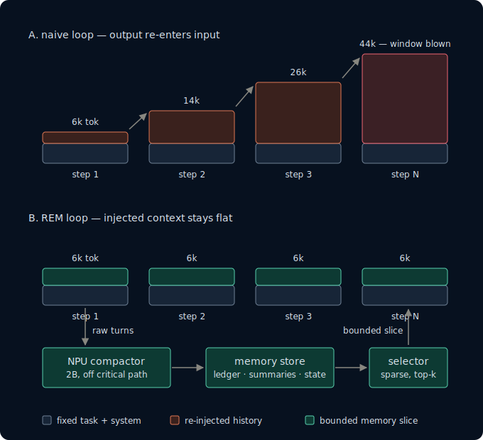

# REM — bounded context for long-running local agents


The **model is the brain**, **REM is the notebook**, and the **environment is the
world** the agent acts on. The brain chooses the next move; the world returns files,
tool results, and scores; REM decides which notes stay on the brain's small desk.

A naive agent loop puts every observation and answer back into the next prompt, so
injected context compounds until the window blows. REM files bulky history outside the
model and injects a bounded, useful slice each step: the task can keep growing while the
working context stays flat.

<table><tr><td bgcolor="#07111f">

</td></tr></table>

<p align="center"><em>Illustrative schematic, not a benchmark run. The labels show the
shape of compounding versus bounded context.</em></p>

> **Status:** The bounded read-side win is shipped. Project direction is now
> context budget over agent horizon; the
> [agent-horizon harness](docs/agent-horizon-harness-charter.md) is the next milestone.
> No horizon multiplier has been measured yet.

**REM = Resident Externalized Memory.** It is a local-agent memory sidecar that keeps
working context bounded and moves background compaction to the AMD XDNA2 NPU, leaving
the iGPU available for the foreground model. REM is both a practical tool and a
learning repo; start with [TEACHING.md](TEACHING.md) for the concepts or the
[water-audit worked example](TEACHING.md#6-one-task-end-to-end) for one task from start
to graceful handoff.

## What is demonstrated

- **The compactor keeps up in the committed probe.** It drains at **~73 tok/s** while
  the example transcript grows at **~30 tok/s**, a **~2.5× keep-up margin**.
- **Bounded assembly reduces prompt work.** RSB-3 fell **47.6%**, from **27,386** to
  **14,341 tokens**. Prefill changed from **34.16 s** to **0.12 s**; after the
  **30.27 s** re-prefill tax, the net saving was **+3.77 s**.
- **NPU placement has a measured contention budget.** Concurrent compaction cost
  **~3.8%** iGPU decode versus **~4.8%** for the CPU control
  (**3 runs × N=20**).
- **The context wall is real.** Naive assembly overflowed at **37k–58k tokens**
  against a **~32–40k window**, producing `context_overflow` **0/5**.

These are committed artifact-backed measurements. They do **not** establish a horizon
multiplier; the harness needed to measure that target does not exist yet.

## How it works

The sidecar keeps recent turns verbatim, compacts older spans into summaries plus a
facts ledger, and assembles a fit-to-budget context for each request. Compaction runs in
the background; a selector chooses which durable facts and episodes return to the
model's desk.

The next harness separates three concerns:

- **Brain:** a fixed local model chooses actions.
- **Notebook:** naive, truncate, summary, and REM memory policies receive the same run.
- **World:** a deterministic environment emits observations and grades the task.

The canonical illustration is a long water-quality audit. The environment can be
packaged with OpenEnv; an append-only event tape can replay the same run through every
memory policy; and a state card can hand off goal, progress, key facts, and open items
before the context budget is exhausted. See
[Lesson 4 §6](TEACHING.md#6-one-task-end-to-end).

## Run it

```bash
pip install -e ".[dev]"
pytest
```

Benchmark entry points, artifact locations, and hardware prerequisites are documented
in [the placement benchmark](docs/npu-placement-benchmark.md) and
[the implementation roadmap](docs/implementation-roadmap.md).

## Where we need help

- **Run the answerer/arm sweep on other hardware — and report the budget line.**
  Include tokens injected per step, prompt-processing latency, and peak RAM, not only
  accuracy.
- **Share tool-scaffolding prior art for reliable ~2B tool calls.** Deterministic
  ordering, date, and abstention tools should clear the reasoning wall without spending
  the context budget on a larger answerer.
- **Confirm OpenEnv fits fat-observation, ≥100-step tasks.** We need evidence that its
  transport and environment model suit long document-heavy runs.
- **Help design a cheap typed-identity judge.** The bounded problem is deciding whether
  two facts describe the same slot without calling a model on every candidate pair.
- **Share open-webui sidecar integration experience.** Pipeline/filter-hook experience
  would shorten the path to daily dogfooding.

The rationale and contribution surface are in the
[direction review](docs/direction-review-2026-07-03.md).

## License

**MIT License** — see [LICENSE](LICENSE). Free to use, modify, and distribute,
including commercially; keep the copyright and permission notice. Author contact:
[title22.org](https://www.title22.org).
